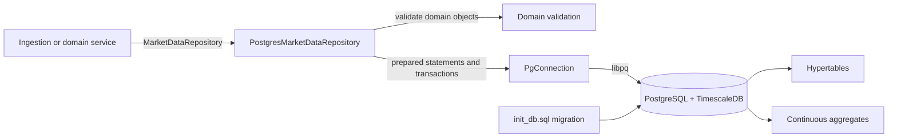

# PostgreSQL Storage Architecture

This folder documents the PostgreSQL persistence code under `src/storage/persistence/postgres` and `include/storage/persistance`.

> Status: the PostgreSQL adapter is compiled as the `postgres_persistence` static library, but it is not linked to `fincore_app` and has no PostgreSQL integration test. The migration also differs from the SQL expected by the adapter; see [known gaps](known-gaps.md).

## Documents

- [Component architecture](components.md) — boundaries, ownership, and runtime flow.
- [Data model and lifecycle](data-model.md) — tables, hypertables, indexes, compression, retention, and aggregates.
- [Configuration and operation](operations.md) — build dependencies, environment variables, startup, and failure behavior.
- [Known integration gaps](known-gaps.md) — concrete differences that must be resolved before end-to-end use.

## Architecture at a glance

The persistence port isolates callers from `libpq`. The PostgreSQL adapter owns one connection and is deliberately not thread-safe, so concurrent writers require separate repository instances.

## Source map

| Responsibility | Source |
|---|---|
| Persistence interface and insert summary | `include/storage/persistance/market_data_repository.hpp` |
| libpq connection, result, error, and transaction wrappers | `include/storage/persistance/postgres/pg_connection.hpp`, `src/storage/persistence/postgres/pg_connection.cpp` |
| PostgreSQL repository implementation | `include/storage/persistance/postgres/postgres_market_data_repository.hpp`, `src/storage/persistence/postgres/postgres_market_data_repository.cpp` |
| Database schema and TimescaleDB policies | `scripts/migrations/init_db.sql` |
| Build target | `CMakeLists.txt` (`postgres_persistence`) |

Note that the existing directory name is spelled `persistance` in public include paths and namespaces use the correctly spelled `persistence`.
