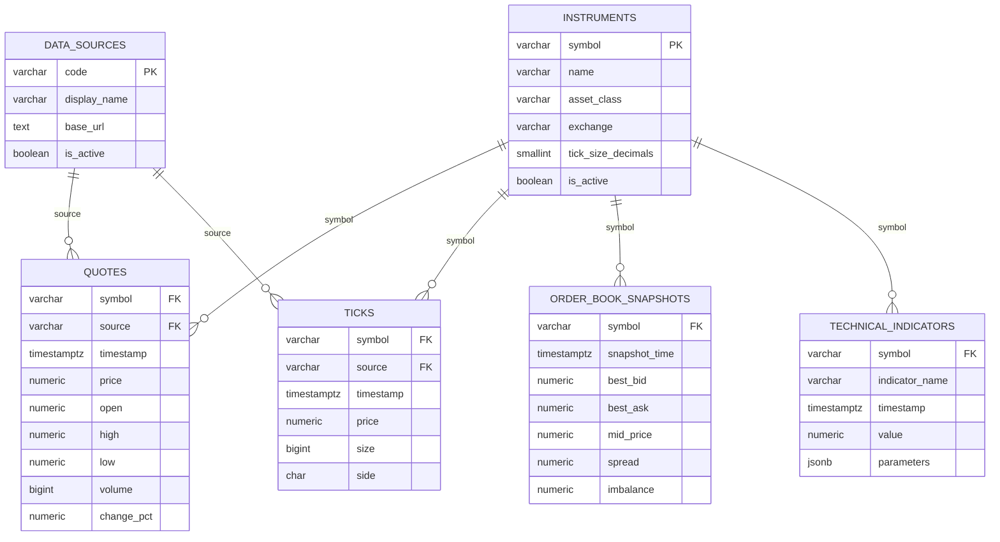

# Data Model and Lifecycle

The migration at `scripts/migrations/init_db.sql` targets PostgreSQL with the TimescaleDB and `pg_stat_statements` extensions.

## Logical model

This diagram reflects the migration as written. The repository expects additional `source` and `trade_id` fields and unique keys described in [known gaps](known-gaps.md).

## Time-series policy

| Dataset | Time column | Chunk interval | Compress after | Retain for | Primary query index |
|---|---|---:|---:|---:|---|
| `quotes` | `timestamp` | 1 day | 7 days | 2 years | `(symbol, timestamp DESC)` including price and volume |
| `ticks` | `timestamp` | 1 hour | 2 days | 90 days | `(symbol, timestamp DESC)` including price, size, side |
| `order_book_snapshots` | `snapshot_time` | 1 hour | 3 days | 90 days | `(symbol, snapshot_time DESC)` |
| `technical_indicators` | `timestamp` | 1 day | 7 days | 1 year | `(symbol, indicator_name, timestamp DESC)` |

Compression is ordered newest-first by the time column and segmented by symbol. `mid_price` and `spread` in order-book snapshots are stored generated columns.

## Continuous aggregates

- `daily_ohlcv` derives daily open, high, low, close, total volume, VWAP, and count from ticks. It refreshes hourly, excluding the newest hour and revisiting the previous seven days.
- `hourly_book_summary` derives spread, imbalance, and midpoint statistics from order-book snapshots. It refreshes hourly, excluding the newest hour and revisiting the previous two days.

## Integrity and deduplication intent

The C++ adapter treats these as natural duplicate keys:

- quotes: `(symbol, source, timestamp)`;
- ticks with a trade ID: `(source, symbol, trade_id)`;
- snapshots: `(symbol, source, snapshot_time)`;
- indicators: `(symbol, source, indicator_name, timestamp, parameters)`.

PostgreSQL can execute `ON CONFLICT` only when matching unique constraints or indexes exist. The current migration does not define these keys, so its schema cannot yet support the adapter's deduplication statements.

## Access model

The migration creates:

- `fincore_writer`, with connect, schema usage, and select/insert privileges;
- `fincore_reader`, with read-only access including continuous aggregates;
- `fincore_app`, a login in the writer role;
- `fincore_analyst`, a login in the reader role.

Passwords in the migration are placeholders and must not be used in production.
